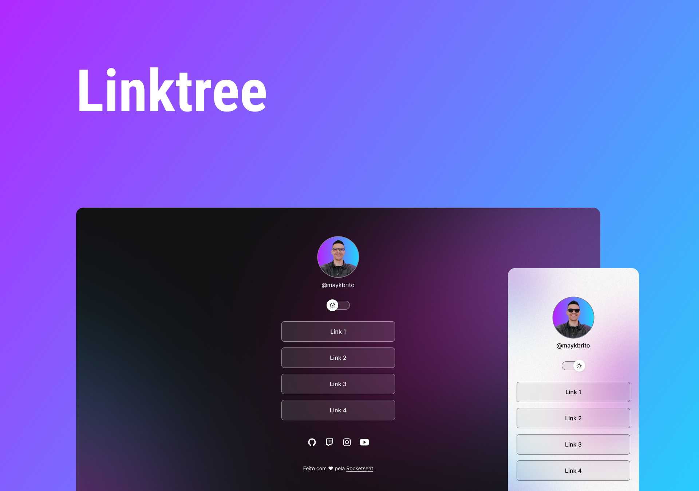

<h1 align="center">
  🔗 Linktree
  
</h1>

<p align="center">
  

  

  <a href="https://github.com/amanda-santos/linktree/commits/master">
    
  </a>

  <a href="https://github.com/amanda-santos/linktree/issues">
    
  </a>
</p>

<p align="center">
  <a href="#-about-the-project">About the project</a>&nbsp;&nbsp;&nbsp;|&nbsp;&nbsp;&nbsp;
  <a href="#-layout">Layout</a>&nbsp;&nbsp;&nbsp;|&nbsp;&nbsp;&nbsp;
  <a href="#-technologies">Technologies</a>&nbsp;&nbsp;&nbsp;|&nbsp;&nbsp;&nbsp;
  <a href="#-preview">Preview</a>&nbsp;&nbsp;&nbsp;|&nbsp;&nbsp;&nbsp;
  <a href="#-getting-started">Getting started</a>&nbsp;&nbsp;&nbsp;|&nbsp;&nbsp;&nbsp;
  <a href="#-how-to-contribute">How to contribute</a>&nbsp;&nbsp;&nbsp;
</p>

## 📝 About the project

<p>This is a link tree project built for learning purposes. Available in English 🇬🇧. 
<br />
Developed based on the DevLinks course by <a href="https://rocketseat.com.br/">Rocketseat</a>. 🚀
</p>

## 🎨 Layout

<p>
  Click <a href="https://www.figma.com/file/gRwjotKJP0SnYwTKmDDFC3/DevLinks-(Community)?node-id=10%3A620&t=Na6PlhDkASoUdg9a-1">here</a> to check the layout on Figma.
</p>

## 👩🏻‍💻 Technologies

Technologies used to develop this project:

- Next.js
- React
- TypeScript
- Styled Components
- React Icons

## 🖥 Preview

https://user-images.githubusercontent.com/49074930/212193611-a7464028-5217-47d1-8f17-b91799e077ac.mp4

https://user-images.githubusercontent.com/49074930/212193622-1d7929bc-c0d7-43c5-97c3-be86c47e3383.mp4

Click <a href="https://linktree-amanda-santos.vercel.app/">here</a> to see it live. 📺

## ⌨ Getting started

- Run `npm install` to install the dependencies
- Open the application with `npm run dev`

## 🤔 How to contribute

**Make a fork of this repository**

```bash
# Fork using GitHub official command line
# If you don't have the GitHub CLI, use the web site to do that.

$ gh repo fork amanda-santos/linktree
```

**Follow the steps below**

```bash
# Clone your fork
$ git clone your-fork-url && cd linktree

# Create a branch with your feature
$ git checkout -b my-feature

# Make the commit with your changes
$ git commit -m 'feat: My new feature'

# Send the code to your remote branch
$ git push origin my-feature
```

After your pull request is merged, you can delete your branch.

---

Made with 💜 by Amanda Santos
